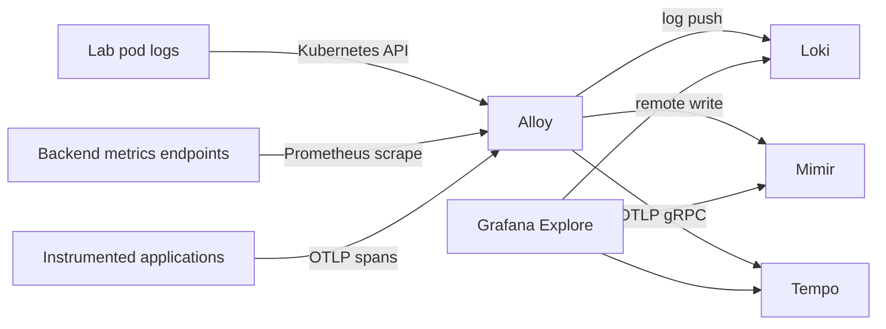

# A small LGTM observability lab for Kubernetes

Start with [GitOps, the bootstrap order, and why the repos are separate](docs/START-HERE.md).

When an application slows down, a running pod does not explain why. This lab gives you three kinds of evidence and a place to explore them: **metrics** show trends, **logs** explain events, and **traces** show a request's path and where it spent time. It is useful for learning SRE troubleshooting, checking a deployment's impact and understanding infrastructure behavior before buying or operating a large monitoring platform.

You do not need every tool on day one. Start by finding one question you cannot answer—such as whether a backend is healthy—then add the signal that answers it. Keeping the collector and its storage observable also prevents a broken monitoring pipeline from looking like a healthy application.

## What each component does

| Component | Job | What you can try |
| --- | --- | --- |
| **Loki** | Store timestamped log lines with a small set of labels | Find errors in a particular pod/namespace with LogQL |
| **Grafana** | Query backends and display their results | Use Explore, build a dashboard, compare signals over the same time range |
| **Tempo** | Store and search distributed traces | Follow a request through instrumented services with TraceQL |
| **Mimir** | Store Prometheus time-series samples received through remote write | Query backend availability and counters with PromQL |
| **Alloy** | Collect and route telemetry | Scrape metrics, read permitted pod logs, accept application OTLP spans |

**LGTM** names the four backends/interface; Alloy is the collector connecting them. Grafana is not the data store. Rancher is a cluster-management application, not another telemetry backend or Kubernetes distribution.



Logs do **not** automatically produce traces. Your application needs an OpenTelemetry SDK or appropriate automatic instrumentation, trace context propagation between services, and an OTLP exporter. This chart receives traces only; applications sending OTLP metrics/logs need extra Alloy signal pipelines. No service graph/span-metrics generator is enabled, so those dashboards should not be expected to populate automatically.

## What the repository actually installs

A small custom Helm chart renders Deployments, private ClusterIP Services, ConfigMaps, five PVCs, namespaced read-only Alloy log RBAC and an ingress NetworkPolicy. Everything has **one replica**, uses filesystem-backed persistent storage and a Recreate strategy. This keeps the architecture understandable and avoids two processes writing the same data directory; upgrades have downtime. These are lab choices, not HA or a production sizing recommendation.

Pins verified against official releases and registry manifests on **2026-10-03**:

| Component | Version | Requested RAM / limit | PVC |
| --- | --- | --- | --- |
| Grafana | 13.2.3 | 256 MiB / 512 MiB | 2 GiB |
| Loki | 3.7.8 | 256 MiB / 768 MiB | 10 GiB |
| Tempo | 3.1.0 | 256 MiB / 768 MiB | 10 GiB |
| Mimir | 3.2.1 | 512 MiB / 1536 MiB | 20 GiB |
| Alloy | 1.20.1 | 128 MiB / 512 MiB | 2 GiB |

Images include immutable multi-architecture digests in `chart/values.yaml`. The default total is **1408 MiB RAM requested, 4 GiB in memory limits, 650m CPU requested, 44 GiB storage**. Leave at least roughly 6 GiB free cluster memory plus control-plane/workload headroom for low-volume experimentation. Limits are ceilings, not reserved capacity; real memory/cardinality/query behavior must be measured. Small caps can OOM under larger workloads.

Mimir explicitly uses its classic single-process ingest path and filesystem blocks; **S3 is not mandatory for this lab**. Tempo 3 monolithic mode uses its new live-store/backend scheduler and local blocks without Kafka. Distributed/production designs need a different architecture and storage plan. Loki/Mimir/Tempo retention is approximately 24 hours, with asynchronous cleanup; this is not a guarantee that a full disk cannot occur. Watch PVC use and collector queue/WAL growth.

### Security boundaries

There are no ingress/NodePort/LoadBalancer resources. Only Grafana gets a login; its random initial credentials come from an ignored local Secret file. Loki, Tempo and Mimir are unauthenticated, single-tenant services in this lab. Backend connections and OTLP use plaintext **inside the restricted private cluster network**. Alloy's `tls.insecure=true` selects plaintext OTLP here; it is not an example of disabling certificate checks on a public endpoint. Production/multi-tenant deployments require authentication, TLS, tenant isolation and a proper access gateway.

The NetworkPolicy allows backend communication inside the dedicated namespace and OTLP from explicitly labeled application namespaces (`lgtm-client: "true"`). It requires a CNI that enforces NetworkPolicy; a Service being ClusterIP alone is not an authorization boundary. No egress-deny policy is included: Alloy needs DNS and API-server access, and pod placement changes the destination paths. If you add one, model those dependencies first.

Alloy reads only logs from its own namespace using Kubernetes API permissions; it gets no cluster-admin, hostPath mount or root collector. Backends do not receive Kubernetes service-account tokens. Extending log coverage requires both discovery configuration and matching reviewed RBAC in each chosen namespace. Do not casually collect secrets, customer payloads or every namespace.

## Start with an existing workload cluster

This repository creates **no VMs and no Kubernetes cluster**. Use the sibling `kubeadm-proxmox-lab` or a dedicated downstream K3s/RKE2 cluster managed by Rancher. Put this observability lab on a **workload cluster**, rather than starving Rancher's management cluster. For bare metal, the same manifests work once Kubernetes, networking and storage are healthy.

Prerequisites: Helm, kubectl, Python 3, a private kubeconfig for the intended cluster, enforcing CNI, available resources, and an existing dynamic StorageClass. K3s commonly includes `local-path`; the kubeadm example intentionally does not install a storage provisioner. Add a reviewed CSI/provisioner first. Local-path ties volumes to a node and does not survive losing that node's disk; a PVC is not a backup.

The fixed namespace is `observability`. The install script refuses an existing namespace not labeled as this lab, because adding a namespace-wide policy to someone else's workloads could interrupt them.

### 1. Review entirely offline

```sh
./scripts/render.sh
# To see the chosen storage class in the rendered PVCs:
./scripts/render.sh --set-string storageClass=local-path
# Read chart/values.yaml, chart/configs/* and .rendered/lgtm.yaml.
```

`helm lint` and `helm template` do not contact Kubernetes. The rendered file contains **no Secret**. Do not run the install script during review. `VALIDATION.md` describes the actual local checks and their limits.

### 2. Prepare an initial login privately

```sh
./scripts/prepare-secret.sh
```

This generates a random password into `.secrets/grafana-admin.json`, mode 0600 inside a 0700 directory, and prints no credential. The file is ignored by Git; keep it encrypted/protected and never attach it to an issue. The script refuses to overwrite an existing file. Kubernetes Secret data is base64 encoding, not encryption: use cluster encryption-at-rest and restrict Secret RBAC. There are no Vault credentials or estate secrets in this example.

Changing the bootstrap Secret after Grafana's database is initialized does not automatically rotate its stored admin password. Use a separate reviewed rotation workflow rather than regenerating the file and assuming the login changed.

### 3. Install only after your review

```sh
export KUBECONFIG=/PRIVATE/PATH/workload-cluster.yaml
kubectl config current-context
export EXPECTED_CONTEXT=YOUR_REVIEWED_WORKLOAD_CONTEXT
export STORAGE_CLASS=YOUR_EXISTING_STORAGE_CLASS
# The following changes that chosen cluster; execute only when you intend to deploy.
LAB_INSTALL_ACK=yes ./scripts/install.sh
kubectl -n observability get deployments,pods,pvc,services
```

Check the kubeconfig/context first. The script applies only the dedicated namespace/private Secret and the local chart; it does not use a Proxmox token, alter nodes or set up Rancher. PVCs must bind, and every deployment must become Ready. If a PVC is Pending, inspect StorageClass availability, capacity, topology and provisioner events before increasing timeouts.

## Use Grafana through a local tunnel

```sh
kubectl -n observability port-forward --address 127.0.0.1 service/grafana 3000:3000
```

Open `http://127.0.0.1:3000` on your own workstation. The session uses the Kubernetes API's authenticated tunnel; it binds only localhost. Read the protected local login file privately when needed. Do not expose this development HTTP session on your LAN or add a public ingress without a reviewed TLS/authentication design.

Mimir, Loki and Tempo data sources are provisioned automatically. In **Explore**:

- Mimir: `up{cluster="homelab"}` should show the five backend scrape targets. Inspect Alloy if a target is zero or absent.
- Loki: `{cluster="homelab", namespace="observability"}` should return recent lab pod logs. The default discovery does not collect application namespaces.
- Tempo: a trace appears only after an instrumented application emits spans to Alloy. Empty results alone do not prove a broken backend.

A Ready pod proves process readiness, not successful collection/storage/query. Check each signal end-to-end. For metrics inspect scrape status, remote-write errors and the query result; for logs inspect source/write errors and current timestamps; for traces inspect emitted spans, Alloy export failures and Tempo search.

## Send traces from an application

Use an application deployment in an approved namespace, labeled through its namespace manifest:

```yaml
apiVersion: v1
kind: Namespace
metadata:
  name: sample-app
  labels:
    lgtm-client: "true"
```

Set the instrumented application's exporter configuration, for example:

```yaml
env:
  - name: OTEL_SERVICE_NAME
    value: sample-app
  - name: OTEL_EXPORTER_OTLP_PROTOCOL
    value: http/protobuf
  - name: OTEL_EXPORTER_OTLP_ENDPOINT
    value: http://alloy.observability.svc.cluster.local:4318
```

These variables configure an **existing exporter**; they do not instrument arbitrary application code. Add the language's OpenTelemetry SDK/agent and propagation middleware, then make a real request and look up the resulting trace. HTTP OTLP clients append the `/v1/traces` path to the base endpoint according to their SDK. The alternate gRPC endpoint is Alloy port 4317. Keep payloads sanitized and sampling deliberate.

For the wider bootstrap order and repository layout, read [START-HERE](../homelab-gitops-guide/docs/START-HERE.md) in the sibling GitOps guide.

## Terraform, manifests, GitLab and KAS

Bootstrap your local GitLab outside the Kubernetes cluster it will later manage, so you can still reach recovery code when that cluster fails. A Terraform repository owns the VM/network lifecycle and state; this **manifest repository** owns in-cluster telemetry resources. Store application deployments separately as they grow. Neither a Helm uninstall nor a Terraform destroy is a telemetry backup workflow.

GitLab CI can lint/render/schema-check this chart before a reviewed deployment job. A GitLab Agent inside the workload cluster connects outbound to **KAS**, allowing authorized jobs to reach Kubernetes without publicly exposing API port 6443. The registration token stays in protected secret delivery, not these manifests. Authorize only intended projects. On GitLab CE/Free, CI uses the agent's service-account identity by default, so scope that account's Kubernetes RBAC to the required namespaces/verbs. CI-job impersonation (`access_as.ci_job`) is a Premium/Ultimate feature and needs its own impersonation/RBAC configuration; do not assume it works on CE. Cluster-admin is not a prerequisite for every application job.

KAS provides connectivity; it does not itself reconcile Git. If you choose GitOps, a controller such as Flux reconciles reviewed desired state from your manifest repository. Keep Secret material in your chosen secret-management/encryption workflow and give the reconciler only necessary permissions. [GitLab agent CI documentation](https://docs.gitlab.com/user/clusters/agent/ci_cd_workflow/) explains contexts and impersonation.

## Backups, troubleshooting and cleanup

Back up Grafana's database/provisioning and all telemetry PVCs with a storage-aware, application-consistent process. The retained files may include sensitive operational data. Protect backups, retain a copy of versioned configs, and practice a restore to a separate namespace/cluster. A node-local PV, cloud snapshot or Helm history is not automatically a tested backup.

For failures, inspect pod events/resource pressure, PVC bindings, backend readiness and Alloy logs. Check DNS, NetworkPolicy enforcement and exporter protocol/path before adding resources. Self-scraping this stack is helpful, but a completely failed stack cannot report its own outage; independent external checks are a separate extension. No predefined production alerts, full node-exporter/cAdvisor metrics, kube-state-metrics, app dashboards or HA are included.

After backing up, inspect the release and choose a deliberate uninstall:

```sh
helm --namespace observability status lgtm
# Intentional cleanup, only after checking the exact context and your backup:
helm --namespace observability uninstall lgtm
```

PVCs have `helm.sh/resource-policy: keep`, so uninstall preserves stored data. Remove retained PVCs/Secrets/namespace only as a separately reviewed cleanup; depending on the StorageClass reclaim policy, deleting a PVC can permanently delete its disk. No destroy/delete automation is provided.

## Official references

- [Loki filesystem storage](https://grafana.com/docs/loki/latest/configure/storage/)
- [Mimir object-storage backends, including filesystem for monolithic labs](https://grafana.com/docs/mimir/latest/configure/configure-object-storage-backend/)
- [Tempo monolithic local deployment](https://grafana.com/docs/tempo/latest/set-up-for-tracing/setup-tempo/deploy/locally/)
- [Alloy Kubernetes log collection](https://grafana.com/docs/alloy/latest/reference/components/loki/loki.source.kubernetes/)
- [Alloy Prometheus remote write](https://grafana.com/docs/alloy/latest/reference/components/prometheus/prometheus.remote_write/)
- [Alloy OpenTelemetry receiver](https://grafana.com/docs/alloy/latest/reference/components/otelcol/otelcol.receiver.otlp/)

This repository is a sanitized **local review draft**. No infrastructure or cluster was changed, and nothing was published while preparing it.

## Why the CI jobs have separate phases

Terraform owns VM allocation and cloud-init inputs; Ansible owns host bootstrap. Kubernetes manifests and Helm own workloads inside the resulting cluster. GitLab KAS connects an agent to GitLab for authorized Kubernetes access without exposing port 6443 publicly; it does not provision VMs or bypass Kubernetes RBAC. Community Edition uses the agent service account scope; CI job impersonation requires the applicable Premium/Ultimate tier.

The public repository validates code on an unprivileged hosted GitHub runner. Its deployment job is deliberately disabled: self-hosted runners belong in your own private deployment repository, never a public fork that accepts outside code. `workflow_dispatch`, a private repository, the default branch, and `DEPLOY_ENABLED=true` must all match before deployment runs. The `homelab` environment can enforce reader-owned approval and secret policies; creating its name alone does not configure approvals. GitLab uses a private project, protected default branch, manual job, protected `homelab` runner and `resource_group`. Configure a separate unprivileged `validation` runner for GitLab validation. Do not share the deployment runner with untrusted projects.

Create a private copy using the CLI, after reviewing the source:

```sh
git clone https://github.com/RayEvelyn/lgtm-kubernetes-lab.git
cd lgtm-kubernetes-lab
gh repo create YOUR-OWNER/lgtm-kubernetes-lab-deployment --private --source . --remote deployment --push
# Target this private repository for subsequent gh secret/variable commands.
gh variable set DEPLOY_ENABLED --body false --repo YOUR-OWNER/REPO
```

For GitLab, create a private project with `glab repo create --private`, push the reviewed checkout there, protect its default branch, and register a protected deployment runner. Store secrets as masked, protected environment-scoped CI variables; public settings belong in regular variables. Importing source does not transfer GitHub secrets, runners or state. Set `HOMELAB_ACTION` when starting the GitLab manual job; it defaults to `plan`.

### Manifest-only deployment

This repository does not allocate VMs. First create and verify a workload cluster using the kubeadm or K3s/Rancher example. The private Linux homelab runner needs Helm, kubectl, Python 3, and private connectivity to that cluster. Provide `HOMELAB_KUBECONFIG` as a protected CI secret using a dedicated identity with the permissions required for the reviewed observability namespace, storage class discovery and Helm resources. Set nonsecret `EXPECTED_CONTEXT` and `STORAGE_CLASS`. Provide a stable, reader-generated `GRAFANA_ADMIN_PASSWORD` protected secret; reruns preserve that chosen credential instead of inventing a new password. Local interactive setup still uses `prepare-secret.sh`. CI writes the Secret JSON and kubeconfig into a private temporary directory, removes both afterward, and refuses an existing namespace without this lab's ownership label. Helm/PVC retention is not a backup: back up the stateful data separately.

`plan` renders the chart without a cluster call; `deploy` explicitly applies the reviewed configuration. Use one deployment platform as owner of this release; GitHub concurrency and GitLab resource groups serialize their own repository jobs, not competing platforms. Applications must be instrumented to emit OTLP traces; logs do not create traces automatically.

CI configuration has been checked locally as recorded in VALIDATION.md where present. No example workflow has been run against your infrastructure. The private runner prerequisites, network trust, secret values and first real deployment remain reader responsibilities. Official references: [GitHub runner guidance](https://docs.github.com/en/actions/how-tos/write-workflows/choose-where-workflows-run/choose-the-runner-for-a-job), [GitLab protected/manual jobs](https://docs.gitlab.com/ci/jobs/job_control/), [Terraform local backend](https://developer.hashicorp.com/terraform/language/backend/local).
